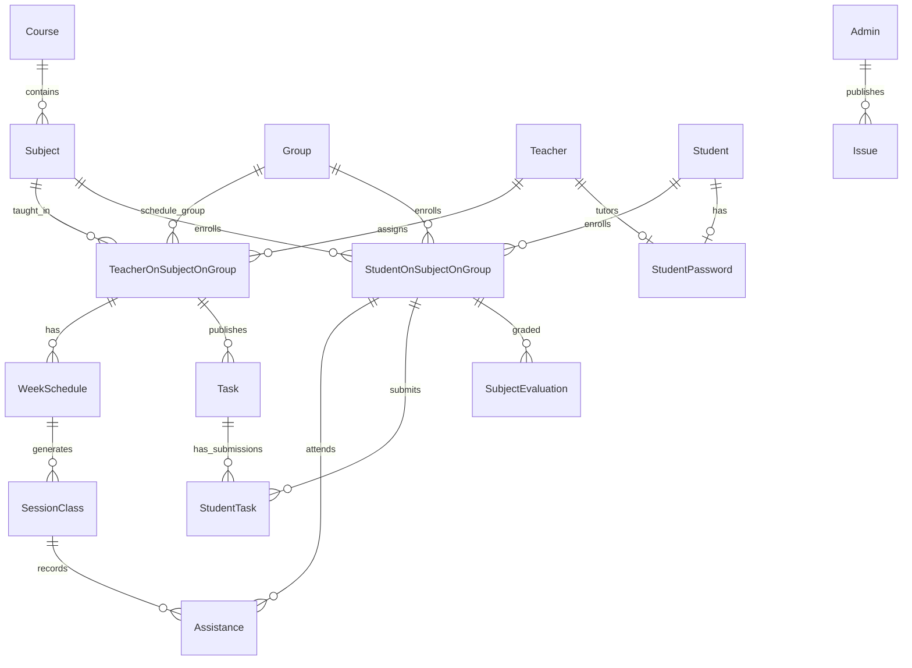

# Arquitectura general del sistema Ziryab

**Proyecto:** Plataforma de gestión escolar (TFG)  
**Repositorios:** `ZiryabFront` (cliente SPA) · `ZiryabBack` (API REST)  
**Versión del documento:** 1.0 — Mayo 2026

---

## Índice

1. [Visión general](#1-visión-general)
2. [Diagrama de arquitectura](#2-diagrama-de-arquitectura)
3. [Componentes principales](#3-componentes-principales)
4. [Flujo de datos entre capas](#4-flujo-de-datos-entre-capas)
5. [Tecnologías utilizadas](#5-tecnologías-utilizadas)
6. [Decisiones de diseño](#6-decisiones-de-diseño)
7. [Estructura de carpetas](#7-estructura-de-carpetas)
8. [API — endpoints principales](#8-api--endpoints-principales)
9. [Esquema de base de datos](#9-esquema-de-base-de-datos)
10. [Seguridad y despliegue](#10-seguridad-y-despliegue)
11. [Referencias](#11-referencias)

---

## 1. Visión general

**Ziryab** es una aplicación web para la gestión académica de un centro de formación profesional: usuarios con tres roles (`STUDENT`, `TEACHER`, `ADMIN`), matrículas por asignatura y grupo, horarios semanales, sesiones de clase, asistencia, tareas, calificaciones por trimestre, incidencias/comunicados y notificaciones en tiempo real.

La arquitectura sigue un patrón **cliente–servidor en tres capas**:

| Capa | Responsabilidad |
|------|-----------------|
| **Presentación** | Angular 19 (SPA), guards por rol, i18n |
| **Aplicación** | API REST Express 5, lógica modular, validación Zod |
| **Datos** | PostgreSQL vía Prisma ORM |

La autenticación combina **Firebase Authentication** (credenciales en el cliente) con un **JWT propio** emitido por el backend (sesión hacia la API y autorización por rol).

---

## 2. Diagrama de arquitectura

### 2.1 Vista de contenedores (C4 simplificado)


```text
┌────────────────────── Navegador / Cliente ──────────────────────┐
│  Angular 19 SPA (ZiryabFront)                                     │
│       │                    │                                      │
│       │ Firebase SDK       │ HTTPS JSON (JWT + cookies)           │
│       ▼                    ▼                                      │
└───────┼────────────────────┼──────────────────────────────────────┘
        │                    │
        │                    │  SSE notificaciones
        ▼                    ▼
┌─────────────── Servicios externos ─────────┐   ┌── Servidor app ──┐
│  Firebase Auth          Cloudinary         │   │ Express 5 API    │
└────────────────────────────────────────────┘   │  :3000           │
        ▲                    ▲                   │ Swagger /api-docs│
        │                    │                   └────────┬─────────┘
        └────────────────────┴────────────────────────────┘
                                    │
                                    ▼
                         ┌── Persistencia ──┐
                         │ Prisma Client    │
                         │       │          │
                         │       ▼          │
                         │  PostgreSQL      │
                         └──────────────────┘
```

### 2.2 Capas internas del backend


```text
HTTP Request
     │
     ▼
┌──────────── Express 5 ────────────┐
│ Middlewares → Routes → Controllers │
│                      → Services   │
└─────────────────┬─────────────────┘
                  │
        ┌─────────┼─────────┐
        ▼         ▼         ▼
     Prisma   Firebase   Cloudinary
        │
        ▼
   PostgreSQL
```

### 2.3 Capas internas del frontend


```text
pages (alumno / profesor / admin / shared)
     │
     ├──► AuthGuard / RoleGuard
     └──► core/services ──► auth.interceptor ──► environment.apiUrl (API)
                │
                └──► core/models
```

---

## 3. Componentes principales

### 3.1 Frontend (`ZiryabFront`)

| Componente | Ubicación | Función |
|------------|-----------|---------|
| **App bootstrap** | `app.config.ts`, `app.component.ts` | Providers globales: router, HTTP, Firebase Auth, ngx-translate, inicialización de sesión |
| **Rutas** | `app.routes.ts` | Enrutamiento por rol; lazy loading en pantallas pesadas |
| **AuthGuard** | `core/guards/auth.guard.ts` | Bloquea rutas sin sesión JWT válida |
| **RoleGuard** | `core/guards/role.guard.ts` | Comprueba `data.roles` frente al rol del usuario |
| **AuthService** | `core/services/auth.service.ts` | Orquesta Firebase → backend (`/api/auth/login`) y estado `BehaviorSubject` |
| **FirebaseAuthService** | `core/services/firebase-auth.service.ts` | Login/registro con email y contraseña en Firebase |
| **auth.interceptor** | `core/interceptors/auth.interceptor.ts` | Añade `Authorization: Bearer` y `withCredentials` a peticiones API |
| **Servicios de dominio** | `core/services/{admin,alumno,profesor}/` | Clientes HTTP tipados con `ApiResponse<T>` |
| **Páginas por rol** | `pages/alumno`, `pages/profesor`, `pages/admin` | UI de negocio (clases, tareas, horarios, panel admin CRUD) |
| **i18n** | `assets/i18n/{es,en,de}.json` | Textos traducibles (es por defecto) |

### 3.2 Backend (`ZiryabBack`)

| Componente | Ubicación | Función |
|------------|-----------|---------|
| **Entrypoint** | `src/index.ts` | Arranque del servidor HTTP |
| **app.ts** | `src/app.ts` | Middlewares globales, registro de rutas `/api/*`, Swagger, health |
| **Módulos de negocio** | `src/modules/<recurso>/` | Patrón **routes → controller → service** (+ `schema.ts` con Zod) |
| **auth** | `modules/auth/` | Login/registro: verifica ID token Firebase, emite JWT, cookie `auth_token` |
| **middleware/auth** | `middleware/auth.ts` | Valida JWT (cookie, Bearer o query para SSE) → `req.user` |
| **middleware/authorize** | `middleware/authorize.ts` | Restricción por rol (`ADMIN`, `TEACHER`, `STUDENT`) |
| **Prisma** | `config/prisma.ts`, `prisma/schema.prisma` | ORM y modelo relacional |
| **Firebase Admin** | `config/firebase.config.ts` | Verificación de tokens en servidor |
| **Swagger** | `config/swagger.ts` | Documentación interactiva en `/api-docs` |
| **Logger** | `utils/logger.ts` | Winston (no `console.log` en producción) |

### 3.3 Base de datos

PostgreSQL almacena el **dominio académico completo**: personas (tablas separadas por rol), cursos, grupos (turno), asignaturas, asignaciones profesor–asignatura–grupo, matrículas alumno, horarios, sesiones, asistencia, tareas, entregas, evaluaciones, incidencias y notificaciones.

### 3.4 Servicios externos

| Servicio | Uso |
|----------|-----|
| **Firebase Auth** | Registro/login de usuarios; `firebaseUID` como clave de enlace con BD local |
| **Cloudinary** | Subida de adjuntos (tareas, justificaciones de ausencia, incidencias) |
| **Google Calendar** (embed) | Calendario institucional en vista compartida (solo frontend) |

---

## 4. Flujo de datos entre capas

### 4.1 Autenticación y sesión

```text
Usuario
  │  email + password
  ▼
Angular SPA ──────────────────► Firebase Auth
  │                                  │
  │                                  └──► ID Token (Firebase)
  │
  │  POST /api/auth/login { token }
  ▼
Express API ──────────────────► Firebase Admin (verifyIdToken)
  │
  │  buscar Student | Teacher | Admin por firebaseUID
  ▼
PostgreSQL
  │
  └──► respuesta: JWT + perfil + cookie auth_token
         │
         ▼
       Angular SPA guarda JWT (localStorage)
         │
         └──► siguientes peticiones: Authorization Bearer + withCredentials
                (ej. GET /api/auth/me)
```

**Puntos clave:**

1. Firebase **no** sustituye la autorización de negocio: el backend decide el rol y el `id` local.
2. El JWT incluye `sub`, `email`, `firebaseUID`, `role`.
3. En producción cross-origin, el **Bearer** es imprescindible; la cookie httpOnly complementa en mismo sitio.

### 4.2 Operación CRUD típica (ejemplo: listar tareas del profesor)

```text
Componente Angular (profesor)
  │
  │  getTasksByAssignment(id)
  ▼
TaskService
  │
  │  HttpClient GET /api/tasks/teacher-assignment/:id
  ▼
auth.interceptor  ──►  añade Authorization: Bearer
  │
  ▼
Express API
  │  task.routes → task.controller → task.service
  │  middleware: auth → authorize(['TEACHER', ...])
  ▼
Prisma  ──►  findMany Task (idTeacherAssignment)
  │
  ▼
PostgreSQL  ──►  filas de tareas
  │
  └──► respuesta JSON { message, data }  ──►  Observable<Task[]> en el componente
```

### 4.3 Notificaciones en tiempo real (SSE)

```text
Angular SPA
  │
  │  EventSource: GET /api/notifications/events?token=<JWT>
  │  (EventSource no puede enviar cabeceras; el token va en query)
  ▼
Express API
  │  middleware auth (lee query.token)
  │
  │  ┌── cada N segundos ──────────────────────┐
  │  │  consulta Notification (no leídas)      │
  │  │           │                           │
  │  │           ▼                           │
  │  │      PostgreSQL                       │
  │  │           │                           │
  │  │           └──► envía evento SSE ──────┼──► Angular actualiza lista/badge
  │  └───────────────────────────────────────┘
  ▼
(conexión SSE abierta mientras el usuario tiene la sesión activa)
```

### 4.4 Subida de ficheros

1. El cliente envía `multipart/form-data` (Multer en backend).
2. El service sube a **Cloudinary** y persiste la URL en BD (`attachmentUrl`, `justificationUri`, etc.).
3. Rutas legacy `/uploads` sirven ficheros antiguos en disco local.

### 4.5 Contrato JSON de la API

Todas las respuestas de éxito siguen:

```json
{
  "message": "Descripción legible",
  "data": { }
}
```

Login/registro añaden `token` en la raíz del JSON. Errores: `{ "message": "..." }` con código HTTP 4xx/5xx.

---

## 5. Tecnologías utilizadas

### 5.1 Frontend

| Tecnología | Versión aprox. | Uso |
|------------|----------------|-----|
| Angular | 19.2 | Framework SPA, standalone components |
| TypeScript | 5.x | Tipado estricto |
| RxJS | 7.8 | Flujos asíncronos, `BehaviorSubject` |
| Tailwind CSS | 3.x | Estilos utilitarios |
| SCSS | — | Estilos puntuales por componente |
| ngx-translate | 17 | i18n (es / en / de) |
| @angular/fire | 19 | Integración Firebase Auth |
| Firebase JS SDK | 12.6 | Autenticación cliente |
| Karma + Jasmine | — | Tests unitarios |
| Compodoc | — | Documentación de componentes (`npm run docs`) |

### 5.2 Backend

| Tecnología | Versión aprox. | Uso |
|------------|----------------|-----|
| Node.js | 20+ | Runtime |
| Express | 5.1 | Servidor HTTP, routers |
| TypeScript | 5.x | Código fuente ESM (`"type": "module"`) |
| Prisma | 5.22 | ORM, migraciones, seed |
| PostgreSQL | — | Base de datos relacional |
| Zod | — | Validación de `req.body` |
| jsonwebtoken | 9.x | JWT de sesión API |
| firebase-admin | 13.6 | Verificación de tokens |
| bcrypt | 6.x | Contraseñas de alumnos (módulo credenciales) |
| helmet, cors, express-rate-limit | — | Seguridad HTTP |
| multer + cloudinary | — | Uploads |
| swagger-jsdoc + swagger-ui-express | — | OpenAPI en `/api-docs` |
| Winston | — | Logging |
| Jest + Supertest | — | Tests de integración |

### 5.3 Herramientas y calidad

- **Git** + tags versionados en backend (desarrollo incremental).
- **Jira** (proyecto `CURSO`) — trazabilidad de commits y tareas.
- **Bruno / Postman** — pruebas manuales de API (comentarios en `app.ts`).
- **Render** (script `render:start`) — despliegue con `prisma migrate deploy`.

---

## 6. Decisiones de diseño

| Decisión | Alternativa considerada | Justificación |
|----------|-------------------------|---------------|
| **SPA Angular + API REST separada** | Monolito SSR | Equipos y despliegues independientes; frontend consumible por otros clientes; alineado con TFG full-stack |
| **Firebase solo para identidad** | Auth 100 % propio | Reduce gestión de contraseñas y recuperación; el dominio escolar (roles, matrículas) vive en PostgreSQL |
| **JWT propio tras login Firebase** | Solo ID token Firebase en cada request | Control de payload (`role`, `sub` local), cookies httpOnly, SSE con token en query, rate limiting uniforme |
| **Tres tablas de usuario** (`Student`, `Teacher`, `Admin`) | Tabla `User` única con discriminador | Tipado claro en Prisma; relaciones distintas por rol; evita campos nulos masivos |
| **Clase académica como proyección** (`TeacherOnSubjectOnGroup` + `schoolYear`) | Entidad `Class` explícita | Modelo flexible: misma asignatura en varios grupos/años sin duplicar entidades físicas |
| **Matrícula = `StudentOnSubjectOnGroup`** | Matrícula solo a grupo | Las notas, tareas y asistencia cuelgan del enrollment; coherente con FP (asignatura × grupo × año) |
| **Patrón modular routes/controller/service** | Lógica en routers | Mantenibilidad, tests por capa, convención documentada en `AGENTS.md` |
| **ESM con extensión `.js` en imports** | CommonJS | Compatibilidad Node nativo y `tsx` en desarrollo |
| **Validación Zod en middleware** | Validación manual | Errores 400 homogéneos; schemas reutilizables |
| **Swagger en código** | OpenAPI manual | La documentación vive junto a las rutas y se sirve en `/api-docs` |
| **Standalone components (sin NgModules)** | Módulos Angular clásicos | Menos boilerplate; estándar Angular 19 del proyecto |
| **Guards + `data.roles`** | Lógica de rol en cada componente | Centraliza autorización de navegación; coherente con `authorize()` del backend |
| **Cloudinary para nuevos uploads** | Solo disco local | Escalable en despliegue cloud; URLs persistentes |
| **Notificaciones SSE + polling** | WebSockets | Implementación más simple con Express; suficiente para avisos no críticos |
| **Respuesta `{ message, data }`** | REST “puro” sin envoltorio | Contrato único con el frontend (`ApiResponse<T>`) |

---

## 7. Estructura de carpetas

### 7.1 Backend (`ZiryabBack/src/`)

```
src/
├── app.ts                 # Express: middlewares + montaje /api/*
├── index.ts               # Arranque del servidor
├── firebase.ts
├── config/
│   ├── env.ts             # Variables de entorno validadas
│   ├── prisma.ts          # Instancia única PrismaClient
│   ├── firebase.config.ts
│   └── swagger.ts
├── middleware/
│   ├── auth.ts            # JWT → req.user
│   ├── authorize.ts       # Rol
│   ├── validate.ts        # Zod
│   ├── restrictSelf.ts    # Acceso a datos propios
│   ├── upload.ts
│   ├── rateLimiter.ts
│   ├── requestLogger.ts
│   └── error.ts
├── modules/               # Un directorio por recurso
│   ├── auth/
│   ├── users/
│   ├── students/ | teachers/ | admin/
│   ├── course/ | group/ | subjects/
│   ├── enrollments/ | student-registration/
│   ├── assignments/ | assignment-substitution/
│   ├── weekSchedule/ | classSession/ | assistance/
│   ├── task/ | student-task/
│   ├── subject-evaluation/
│   ├── notifications/ | issue/
│   └── student-passwords/
├── tests/
└── utils/logger.ts

prisma/
├── schema.prisma
├── migrations/
└── seed.ts
```

### 7.2 Frontend (`ZiryabFront/src/app/`)

```
src/app/
├── app.config.ts          # Providers globales
├── app.routes.ts          # Rutas y guards
├── core/
│   ├── configs/
│   ├── guards/            # auth.guard, role.guard
│   ├── interceptors/      # auth.interceptor
│   ├── models/            # Interfaces de dominio
│   ├── services/
│   │   ├── auth.service.ts
│   │   ├── admin/         # CRUD entidades + HTTP especializados
│   │   ├── alumno/
│   │   ├── profesor/
│   │   └── UI/
│   └── i18n/
├── pages/
│   ├── admin/             # Panel administración (entidades, modales)
│   ├── alumno/            # Dashboard, clases, tareas, horario, notas
│   ├── profesor/          # Clases, tareas, asistencia, evaluaciones
│   └── shared/            # login, about, calendario, notificaciones, perfil
└── environments/          # apiUrl, schoolYear, firebase

src/assets/i18n/           # es.json, en.json, de.json
```

---

## 8. API — endpoints principales

**Base URL (desarrollo):** `http://localhost:3000/api`  
**Documentación interactiva:** `http://localhost:3000/api-docs`  
**Health check:** `GET /health`

Prefijos registrados en `src/app.ts`. Casi todas las rutas requieren `auth`; muchas añaden `authorize([roles])`.

### 8.1 Resumen por módulo

| Prefijo | Recurso | Operaciones destacadas |
|---------|---------|------------------------|
| `/api/auth` | Autenticación | `POST /register`, `POST /login`, `GET /me`, `POST /logout`, `POST /verify-firebase` |
| `/api/users` | Usuarios unificados | `GET /`, `GET /me`, `PATCH /me`, `PATCH /me/password`, `GET /:id` |
| `/api/students` | Alumnos | CRUD admin; `GET /:id/subjects`; restricción self en lectura |
| `/api/teachers` | Profesores | CRUD admin; `GET /:id/subjects`, `GET /my-students-absences` |
| `/api/admins` | Administradores | CRUD solo `ADMIN` |
| `/api/courses` | Ciclos formativos | CRUD; listados con asignaturas |
| `/api/groups` | Grupos (turno) | CRUD |
| `/api/subjects` | Asignaturas | CRUD; `GET /:id/teachers`, `/:id/students`, `/:id/course` |
| `/api/assignments` | Asignación prof.–asig.–grupo | `GET /`, filtros, `POST /`, `PATCH /:id` |
| `/api/assignment-substitutions` | Sustituciones | CRUD + `PATCH /:id/close` |
| `/api/enrollments` | Matrículas | `GET /`, `GET /by-filters`, `GET /teacher/:idTeacher` |
| `/api/studentregistration` | Alta matrícula | `POST /` (admin) |
| `/api/horarios-semanales` | Horario semanal | CRUD; `GET /classes`, `POST /materialize`; por assignment, día, teacher, student |
| `/api/sessions` | Sesiones de clase | CRUD; `GET /active`, `POST /start`, `POST /bulk-generate`, `POST /bulk-suspend` |
| `/api/assistances` | Asistencia | CRUD; bulk; justificaciones upload; `GET /my-absences` (alumno) |
| `/api/tasks` | Tareas (profesor) | CRUD + upload; `GET /teacher-assignment/:id` |
| `/api/student-tasks` | Entregas alumnos | CRUD; `PUT /:id/submit`, `PUT /:id/grade`, `POST /upload-submission` |
| `/api/subject-evaluations` | Notas por trimestre | `GET /my` (alumno); `GET /tutored-groups`; bulk por grupo |
| `/api/issues` | Comunicados/incidencias | `GET /`, `POST /`, `PATCH /:id` (audiencias múltiples) |
| `/api/notifications` | Notificaciones | `GET /`, `GET /events` (SSE), `PATCH /:id/read`, `POST /` |
| `/api/student-passwords` | Credenciales alumnos | Tutor/profesor consulta; admin actualiza |

### 8.2 Matriz de autorización (resumen)

| Área | STUDENT | TEACHER | ADMIN |
|------|---------|---------|-------|
| Auth / perfil propio | ✓ | ✓ | ✓ |
| Mis clases, tareas, notas, ausencias | ✓ | — | — |
| Gestión clase, asistencia, tareas, notas tutor | — | ✓ | ✓ |
| CRUD catálogo, assignments, usuarios | — | lectura parcial | ✓ |
| Issues (lectura según audiencia) | ✓ | ✓ | ✓ |
| Issues (crear/editar) | — | — | ✓ |

---

## 9. Esquema de base de datos

Fuente de verdad: `prisma/schema.prisma`. Motor: **PostgreSQL**.

### 9.1 Diagrama entidad–relación (núcleo académico)



### 9.2 Modelos principales

| Modelo | Descripción |
|--------|-------------|
| **Student**, **Teacher**, **Admin** | Usuarios; `firebaseUID` único; `role` por tabla |
| **Course** | Ciclo formativo (ej. DAM) |
| **Group** | Turno físico (mañana/tarde) |
| **Subject** | Asignatura (`grade` 1º/2º dentro del ciclo) |
| **TeacherOnSubjectOnGroup** | Asignación profesor + asignatura + grupo + `schoolYear`; `isTutor`, `status`, sustituto |
| **StudentOnSubjectOnGroup** | Matrícula alumno; estado (`ENROLLED`, `WITHDRAWN`, …) |
| **WeekSchedule** | Franja horaria semanal de una asignación |
| **SessionClass** | Instancia de clase en una fecha |
| **Assistance** | Asistencia por sesión y matrícula; justificación |
| **Task** / **StudentTask** | Tarea y entrega/calificación del alumno |
| **SubjectEvaluation** | Nota por trimestre ligada al enrollment |
| **Notification** | Aviso por `recipientFirebaseUID` |
| **Issue** | Comunicado con `IssueAudience` (centro, curso, alumno, etc.) |
| **AssignmentSubstitution** | Histórico de sustituciones docentes |
| **StudentPassword** | Contraseña gestionada por tutor (alumnos) |

### 9.3 Enums relevantes

- `AssignmentStatus`: ACTIVE, SUSPENDED, ILLNESS, …
- `EnrollmentStatus`: ENROLLED, COMPLETED, FAILED, …
- `EvaluationPeriod`: INITIAL, FIRST_TRIMESTER, …, FINAL
- `SessionStatus`: SCHEDULED, COMPLETED, CANCELLED
- `AssistanceStatus`: PRESENT, ABSENT, LATE, EXCUSED
- `SubmissionStatus`: PENDING, SUBMITTED, GRADED, …
- `TaskType`: PRACTICE, THEORY, EXAM, PROJECT, HOMEWORK
- `IssueAudience`: CENTER, ALL_TEACHERS, GROUP, STUDENT, …

### 9.4 Concepto de “clase académica”

No existe tabla `Class`. Una **clase** (ej. *1º DAM Mañana 2024-2025*) se identifica por la combinación:

- `subject.idCourse` + `subject.grade` + `idGroup` + `schoolYear`

Las asignaciones (`TeacherOnSubjectOnGroup`) y matrículas (`StudentOnSubjectOnGroup`) comparten esa clave lógica.

---

## 10. Seguridad y despliegue

| Medida | Implementación |
|--------|----------------|
| HTTPS | Obligatorio en producción |
| Helmet + CSP | `app.ts` — `connect-src` incluye origen del frontend |
| CORS | Origen del frontend en producción; credenciales habilitadas |
| Rate limiting | `express-rate-limit` en producción |
| JWT | Secreto en `JWT_SECRET`; expiración configurable |
| Roles | Backend `authorize()` + frontend `RoleGuard` (defensa en profundidad) |
| Datos ajenos | `restrictSelf` / `restrictToSelfOrRoles` en rutas de alumno |
| Uploads | Límite de body; validación Multer; URLs en Cloudinary |
| Logs | Winston; sin exponer stack en producción |

**Variables de entorno backend (ejemplos):** `DATABASE_URL`, `JWT_SECRET`, `FRONTEND_URL`, credenciales Firebase Admin, Cloudinary.

**Frontend:** `environment.apiUrl`, `environment.currentSchoolYear`, configuración Firebase.

---

## 11. Referencias

| Recurso | Ubicación |
|---------|-----------|
| Guía agente backend | `ZiryabBack/AGENTS.md` |
| Guía agente frontend | `ZiryabFront/AGENTS.md` |
| Schema Prisma | `ZiryabBack/prisma/schema.prisma` |
| Registro de rutas | `ZiryabBack/src/app.ts` |
| Rutas Angular | `ZiryabFront/src/app/app.routes.ts` |
| API Swagger | `http://localhost:3000/api-docs` (con servidor en marcha) |

---


*Documento generado para evaluación del TFG — Sistema Ziryab. 
