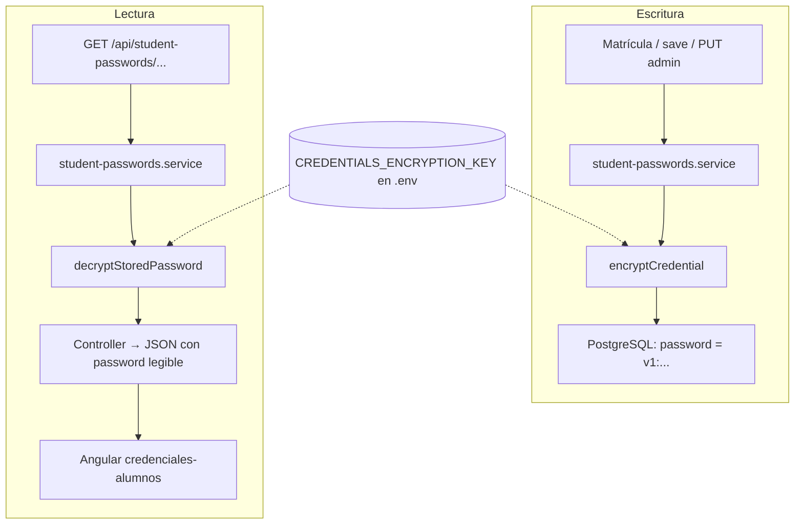

# Cifrado de credenciales de alumnos (StudentPassword)

Documentación técnica del cifrado reversible **AES-256-GCM** aplicado a las contraseñas que los tutores consultan para comunicárselas a sus alumnos.

**Ámbito:** backend Node (`ZiryabBack`). El frontend Angular **no cambió** su contrato con la API.

---

## 1. Contexto y problema

### Requisito de negocio

En Ziryab, el **profesor tutor** debe poder conocer la contraseña inicial (o actual gestionada por el centro) de sus alumnos para indicársela en persona, especialmente cuando el alumno no dispone de correo propio o no recuerda el acceso.

### Implementación original (riesgo alto)

Existía la tabla `StudentPassword` en PostgreSQL con el campo `password` en **texto plano**:

- Cualquier acceso a la BD, backup o dump exponía todas las contraseñas.
- El endpoint `GET /api/student-passwords/tutor/:idTutor` devolvía esas cadenas directamente en JSON.
- Firebase Auth ya almacenaba el hash de la contraseña de login; la tabla era una **segunda copia recuperable**, duplicando superficie de ataque.

### Objetivo de esta mejora

- Mantener la funcionalidad para el tutor (listado y visualización en la app).
- **No almacenar contraseñas legibles** en base de datos.
- Usar un algoritmo estándar y auditable: **AES-256-GCM**.

> **Importante:** esto es cifrado en reposo, no sustituye un diseño donde la contraseña nunca se almacena de forma recuperable (ver sección 8).

---

## 2. Solución adoptada

### Idea general

| Fase | Qué ocurre |
|------|------------|
| **Escritura** (alta, matrícula, actualización admin) | La contraseña en texto plano se cifra en el servidor y solo se persiste el blob `v1:...`. |
| **Lectura** (GET por tutor o alumno) | El servidor lee el blob, descifra en memoria y devuelve `password` legible en JSON al cliente autenticado. |
| **Legacy** | Valores sin prefijo `v1:` se interpretan como texto plano hasta migrarlos. |

La **clave de cifrado** vive únicamente en el entorno del servidor (`CREDENTIALS_ENCRYPTION_KEY`), no en el frontend ni en la base de datos.

### Diagrama de flujo



### Relación con Firebase Auth

| Sistema | Qué guarda |
|---------|------------|
| **Firebase Auth** | Hash irreversible de la contraseña de login (fuente de verdad para autenticación). |
| **StudentPassword** | Copia cifrada para consulta del tutor (conveniencia operativa). |

Si se cambia la contraseña solo en Firebase y no en `StudentPassword`, la app del tutor podría mostrar una clave distinta de la que acepta el login. Los flujos de alta y actualización del backend deben mantener ambos alineados.

---

## 3. Detalle técnico: AES-256-GCM

### Por qué GCM

- **AES-256:** clave de 256 bits.
- **GCM (Galois/Counter Mode):** modo autenticado; detecta manipulación del ciphertext mediante un **auth tag**.
- Implementación nativa en Node.js (`crypto`), sin dependencias extra.

### Formato almacenado en `StudentPassword.password`

```
v1:<base64url( IV(12 bytes) || authTag(16 bytes) || ciphertext )>
```

| Componente | Tamaño | Rol |
|------------|--------|-----|
| Prefijo `v1:` | — | Versión del formato; permite migraciones futuras (`v2:` con otra clave, etc.). |
| IV (nonce) | 12 bytes | Aleatorio **por cada cifrado**; nunca reutilizar el mismo IV con la misma clave. |
| Auth tag | 16 bytes | Integridad/autenticidad del ciphertext (GCM). |
| Ciphertext | variable | Contraseña UTF-8 cifrada. |

### Clave de cifrado (`CREDENTIALS_ENCRYPTION_KEY`)

- **Obligatoria** en todos los entornos (desarrollo, test con placeholder, producción).
- **No reutilizar** `JWT_SECRET` ni otras claves.
- Formatos aceptados:
  - **64 caracteres hexadecimales** (32 bytes), o
  - **Base64** que decodifique exactamente a 32 bytes.

Generación recomendada:

```bash
node -e "console.log(require('crypto').randomBytes(32).toString('hex'))"
```

Añadir el resultado al `.env` (y al panel de variables del hosting, p. ej. Render):

```env
CREDENTIALS_ENCRYPTION_KEY=<64_caracteres_hex>
```

En **tests** (`NODE_ENV=test`), si la variable no está definida, se usa una clave fija de prueba definida en `src/config/env.ts`.

---

## 4. Archivos del proyecto

| Ruta | Responsabilidad |
|------|-----------------|
| `src/utils/credential-crypto.ts` | `encryptCredential`, `decryptCredential`, `decryptStoredPassword`, `isEncryptedCredential`. |
| `src/config/env.ts` | Validación Zod de `CREDENTIALS_ENCRYPTION_KEY`. |
| `src/modules/student-passwords/student-passwords.service.ts` | Cifra en `save` y `updatePasswordByStudent`; descifra en `findByTutor`, `findByStudent` y en retornos de escritura. |
| `src/modules/student-passwords/student-passwords.controller.ts` | Sin cambios de contrato; sigue exponiendo `password` en claro al cliente autorizado. |
| `src/modules/student-registration/student-registration.service.ts` | Llama a `studentPasswordsService.save` → hereda el cifrado automáticamente. |
| `prisma/scripts/encrypt-student-passwords.ts` | Migración one-shot de filas legacy en texto plano. |
| `prisma/seed.ts` | Inserta contraseñas de demo ya cifradas con `encryptCredential`. |
| `src/tests/credential-crypto.test.ts` | Tests unitarios del módulo de cifrado. |
| `README.md` | Variable documentada en la tabla de entorno. |

### API REST (sin cambios de contrato)

| Método | Ruta | Roles | Comportamiento |
|--------|------|-------|----------------|
| `GET` | `/api/student-passwords/tutor/:idTutor` | `ADMIN`, `TEACHER` | Tutor solo su `idTutor`; devuelve `{ success, data: [{ idStudent, studentName, password, idTutor }] }`. |
| `GET` | `/api/student-passwords/student/:idStudent` | `ADMIN`, `TEACHER` | Una credencial; control de tutor asignado. |
| `PUT` | `/api/student-passwords/:idStudent` | `ADMIN` | Actualiza contraseña (se guarda cifrada). |

El frontend consume principalmente `GET .../tutor/:id` desde `StudentPasswordService` y la pantalla `credenciales-alumnos`.

---

## 5. Configuración y despliegue

### Checklist local

1. Generar clave y añadirla al `.env` (**guardar el fichero en disco**, no solo en el editor).
2. Comprobar que el backend arranca: `npm run dev` (Zod fallará si falta la clave).
3. Si ya había filas en texto plano:

   ```bash
   npm run migrate:encrypt-passwords
   ```

4. Opcional: repoblar datos de prueba con `npm run seed` (requiere la misma clave en `.env`).

### Producción (Render u otro)

- Definir `CREDENTIALS_ENCRYPTION_KEY` en variables de entorno del servicio.
- Usar **la misma clave** que cifró los datos de esa base de datos.
- Tras el primer despliegue con esta versión, ejecutar una vez `npm run migrate:encrypt-passwords` contra la BD de producción (o incluir el paso en un job de release controlado).

### Script de migración

```bash
npm run migrate:encrypt-passwords
```

- Carga `.env` **antes** de importar módulos que validan `env.ts` (orden crítico en el script).
- Recorre `StudentPassword`; si `password` no empieza por `v1:`, cifra y actualiza.
- Salida ejemplo: `Listo: 3 migradas, 0 ya cifradas, 3 total.`

---

## 6. Cómo verificar que funciona

### 6.1 Base de datos

```bash
npx prisma studio
```

Tabla **StudentPassword**, columna **password**:

| Estado | Aspecto |
|--------|---------|
| Correcto (cifrado) | Empieza por `v1:`; el resto es ilegible. |
| Legacy (pendiente migración) | Texto legible, p. ej. `Estudiante123456`. |

No debe poder leerse la contraseña real solo inspeccionando la celda.

### 6.2 Aplicación (flujo tutor)

1. Backend en marcha con `CREDENTIALS_ENCRYPTION_KEY` en `.env`.
2. Login como profesor tutor en el frontend.
3. Ir a la pantalla de **credenciales de alumnos**.
4. Mostrar/ocultar contraseña: debe coincidir con la que usa el alumno en login (si los datos están sincronizados con Firebase).

### 6.3 API manual

```http
GET http://localhost:3000/api/student-passwords/tutor/1
Cookie: auth_token=<jwt>
```

o cabecera `Authorization: Bearer <jwt>` según configuración de sesión.

Respuesta esperada: `password` legible en JSON (comportamiento intencionado para el tutor autenticado).

### 6.4 Tests automáticos

```bash
npm test -- src/tests/credential-crypto.test.ts
```

Casos cubiertos:

- Round-trip cifrar → descifrar.
- `decryptStoredPassword` con `v1:` y con texto legacy.
- Fallo con blob corrupto o sin prefijo `v1:` en `decryptCredential`.

### 6.5 Coherencia de la clave

Si se cambia `CREDENTIALS_ENCRYPTION_KEY` sin re-cifrar filas existentes, el descifrado fallará (errores al leer credenciales). Planificar rotación de clave solo con script de re-cifrado o backup previo.

---

## 7. Soporte legacy (texto plano)

La función `decryptStoredPassword` implementa compatibilidad gradual:

```typescript
// Si empieza por v1: → decryptCredential(stored)
// Si no → devolver stored tal cual (texto plano antiguo)
```

Esto permite:

- Desplegar el código antes de ejecutar la migración.
- Evitar caída total si queda alguna fila sin migrar.

Tras `migrate:encrypt-passwords`, todas las filas deberían usar `v1:`.

---

## 8. Riesgos que persisten

El cifrado en reposo **reduce** el riesgo en BD/backups; **no elimina** otros vectores.

### 8.1 Riesgos mitigados (mejora respecto a antes)

| Riesgo | Antes | Ahora |
|--------|-------|-------|
| Lectura casual de PostgreSQL / dump | Contraseñas legibles | Blobs `v1:` sin clave del servidor |
| Backup robado sin `.env` | Expone contraseñas | Expone blobs inútiles sin clave |
| Narrativa de seguridad en memoria/TFG | Débil | Cifrado AES-256-GCM documentado |

### 8.2 Riesgos que **siguen** presentes

| Riesgo | Descripción |
|--------|-------------|
| **Exposición en el cliente** | El API devuelve `password` en claro al tutor autenticado. XSS, malware, extensiones o DevTools pueden capturarla. |
| **Compromiso de cuenta tutor** | Un atacante con sesión del profesor obtiene el listado igual que antes. |
| **Custodia de la clave** | Atacante con **BD + `CREDENTIALS_ENCRYPTION_KEY`** (p. ej. `.env` filtrado en Render) puede descifrar todo offline. |
| **Logs y proxies** | Registrar cuerpos de respuestas HTTP expondría contraseñas. No loguear payloads sensibles. |
| **Almacenamiento recuperable** | Sigue existiendo una copia reversible además del hash de Firebase; no cumple el principio estricto de “nunca guardar contraseñas”. |
| **Desincronización Firebase ↔ BD** | Cambios manuales solo en Firebase dejan la copia cifrada obsoleta. |
| **Rotación de clave** | Cambiar la clave requiere re-cifrar todas las filas o perder acceso a datos antiguos. |

### 8.3 Comparación con alternativa más segura

| Enfoque | Tutor puede dar la clave al alumno | Seguridad global |
|---------|--------------------------------------|------------------|
| Texto plano en BD (antiguo) | Sí, listado permanente | Muy baja |
| **AES-256-GCM (actual)** | Sí, listado permanente | Media en reposo; exposición en tránsito/cliente similar |
| Reset Firebase + mostrar **una sola vez** | Sí, bajo demanda | Alta (no hay copia recuperable en BD) |

Para una evolución futura, valorar sustituir el listado permanente por **regenerar contraseña temporal** vía Firebase Admin y mostrarla una vez en modal (sin persistir recuperable).

---

## 9. Preguntas frecuentes

### ¿El front hay que tocarlo?

No para el cifrado. Sigue usando `StudentPasswordService.getByTutor` y el modelo con `password: string`.

### ¿HTTPS cifra la contraseña?

HTTPS (TLS) cifra el **canal** entre navegador y API. La contraseña en el JSON sigue siendo legible en el cliente una vez descifrada por el servidor.

### ¿Puedo usar la misma clave que JWT_SECRET?

**No.** Debe ser `CREDENTIALS_ENCRYPTION_KEY` dedicada. Compartir claves agrava el impacto de una filtración.

### ¿Qué pasa si olvido la clave de cifrado?

No podréis descifrar las filas existentes. Habría que regenerar contraseñas en Firebase y reescribir `StudentPassword` con una clave nueva.

### ¿El seed funciona sin la clave?

No: `encryptCredential` valida `env` al importar. El `.env` debe contener `CREDENTIALS_ENCRYPTION_KEY` antes de `npm run seed`.

### La migración dice `0 total`

No hay filas en `StudentPassword`. Ejecutad `npm run seed` o matriculad alumnos; luego repetid la migración si alguna fila quedó en claro.

---

## 10. Referencias rápidas

| Comando | Uso |
|---------|-----|
| `npm run dev` | Arrancar API (exige clave en `.env`) |
| `npm run migrate:encrypt-passwords` | Cifrar filas legacy |
| `npm run seed` | Datos demo con contraseñas ya cifradas |
| `npm test -- src/tests/credential-crypto.test.ts` | Tests del módulo crypto |
| `npx prisma studio` | Inspeccionar formato `v1:` en BD |

**Documentos relacionados:** `README.md` (variables de entorno), `prisma/esquema-relacional.md` (modelo `StudentPassword`), `docs/ARQUITECTURA_SISTEMA_ZIRYAB.md`, [`FLUJO_CREDENCIALES_FIREBASE.md`](FLUJO_CREDENCIALES_FIREBASE.md) (cambio de contraseña del alumno, Firebase y flujos objetivo).

---

*Última actualización: implementación AES-256-GCM en módulo `student-passwords` y utilidad `credential-crypto`.*
