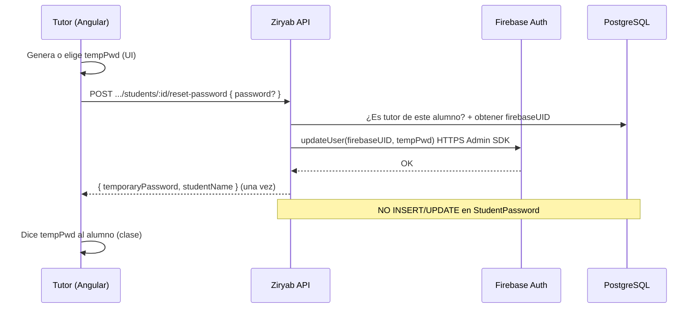
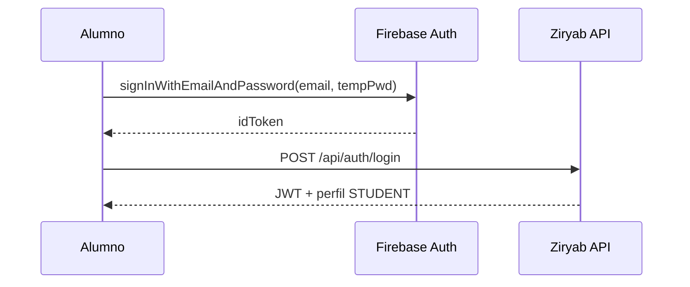
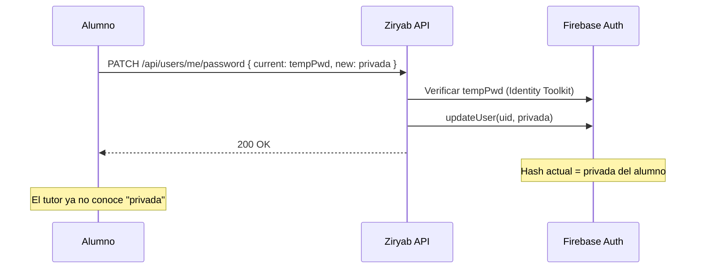
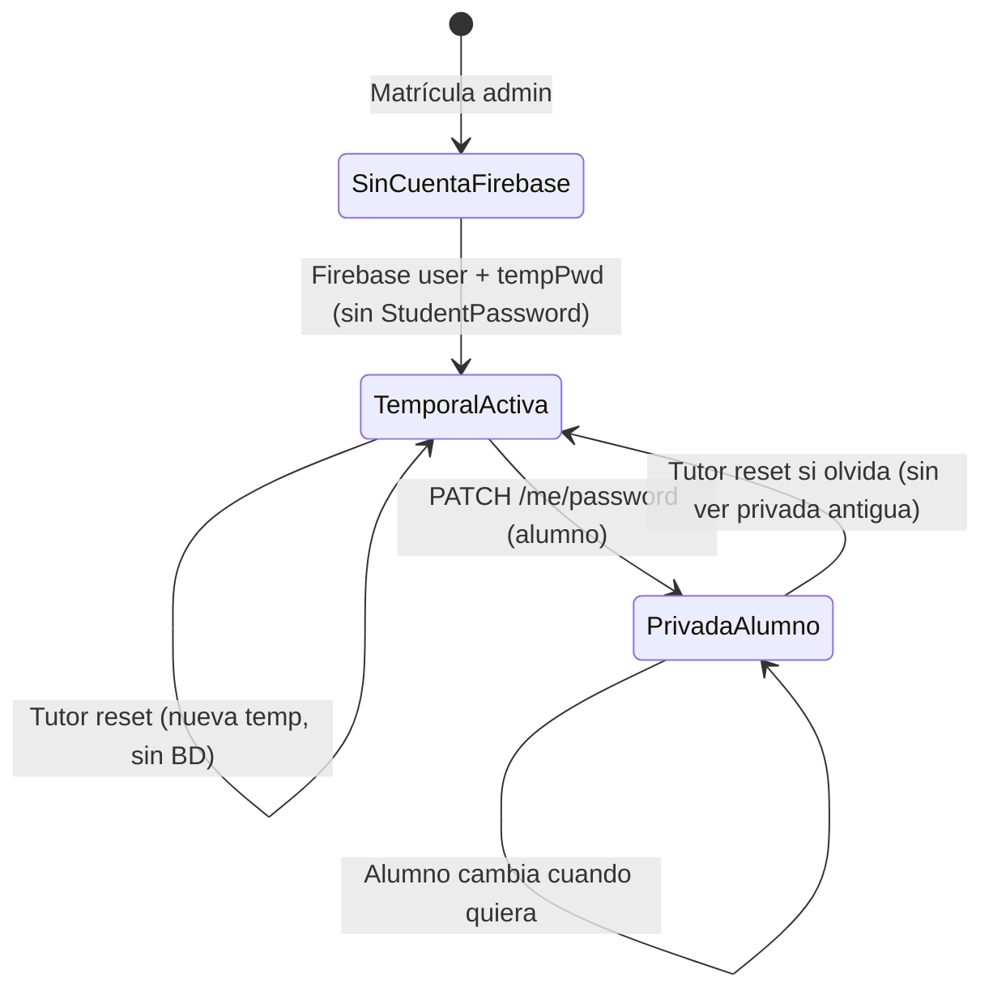
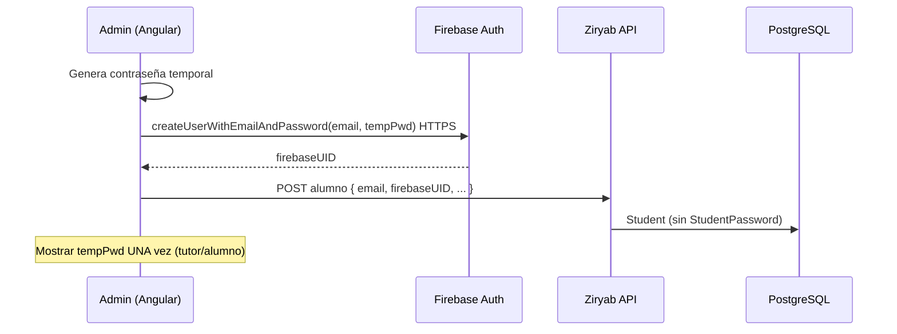
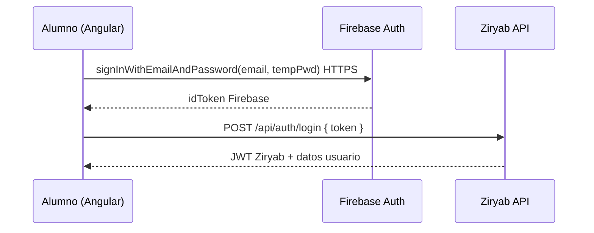
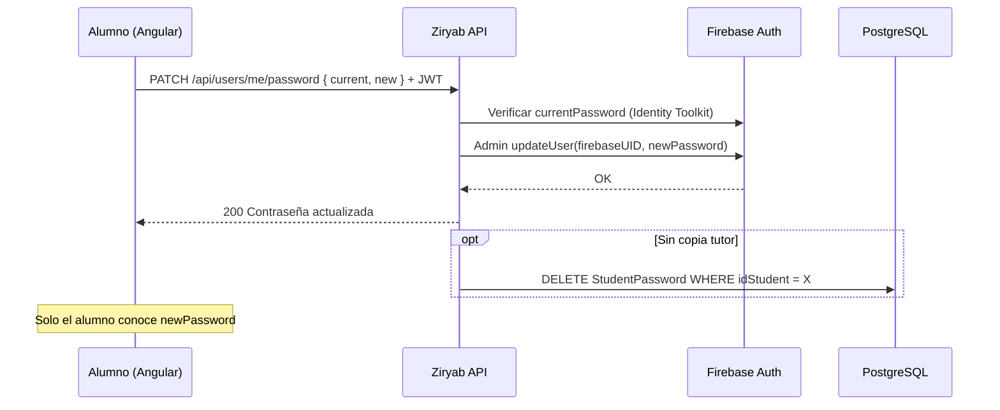
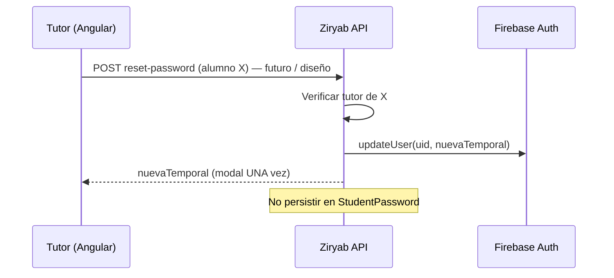
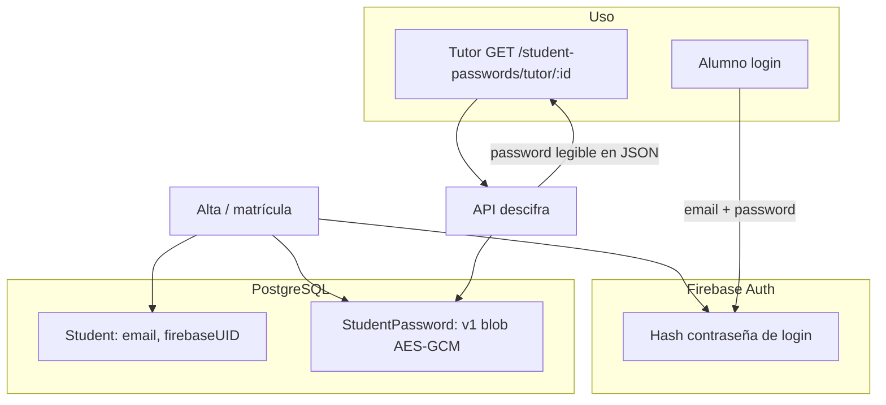

# Flujo de credenciales: Firebase, tutor y cambio de contraseña del alumno

Documento complementario a [`CREDENCIALES_ALUMNOS_CIFRADO.md`](CREDENCIALES_ALUMNOS_CIFRADO.md). Explica **dónde vive la contraseña de login**, la **propuesta objetivo** (profesor genera la contraseña sin almacenarla en PostgreSQL, alumno la cambia después) y cómo contrasta con el diseño actual.

**Estado actual del producto:** las contraseñas de consulta del tutor se guardan cifradas en `StudentPassword` (AES-256-GCM). **No** hay pantalla en el frontend para que el alumno cambie su contraseña, aunque el backend ya expone `PATCH /api/users/me/password`.

**Propuesta recomendada a medio plazo:** ver **sección 2** (flujo completo tutor → Firebase → alumno → cambio de contraseña, sin `StudentPassword`).

---

## 1. Ideas clave

| Concepto | Descripción |
|----------|-------------|
| **Contraseña de login** | La que el alumno escribe en la pantalla de login. Solo existe como **hash** en Firebase Auth. |
| **Ziryab API / PostgreSQL** | Guardan identidad (`email`, `firebaseUID`, rol, datos de alumno). **No necesitan** la contraseña para autenticar cada petición (usan el JWT tras login). |
| **`StudentPassword`** | Copia **opcional** para que el tutor consulte qué contraseña se dio al alta. Cifrada en BDD (`v1:...`). **No** es la fuente de verdad del login. |
| **Fuente de verdad del login** | **Firebase Auth** |

```text
Login alumno:  email + contraseña  →  Firebase (hash)  →  token  →  API Ziryab (JWT)
Consulta tutor:  GET credenciales  →  PostgreSQL StudentPassword (opcional, cifrado)  ← diseño ACTUAL
Consulta tutor (propuesta):  sin listado en BD; solo reset temporal mostrado UNA vez
```

---

## 2. Propuesta: el profesor genera la contraseña, no viaja a la BD, el alumno la cambia después

Esta sección describe el **modelo objetivo** de credenciales para Ziryab: alineado con el requisito de que el tutor pueda **decir** la contraseña al alumno en clase, pero **sin** mantener un archivo recuperable en PostgreSQL ni listados permanentes en la API. El alumno, tras el primer acceso, **personaliza** su secreto de login.

### 2.1 Objetivo y principios

| Principio | Significado |
|-----------|-------------|
| **Un solo secreto de login** | Solo Firebase Auth guarda el hash de la contraseña vigente. |
| **Ziryab no archiva contraseñas** | Ni en texto plano ni cifradas en `StudentPassword` para consulta repetida del tutor. |
| **El profesor genera / comunica la temporal** | Puede inventarla, usar un generador en pantalla o pedir un reset del sistema; la comunica **verbalmente o por escrito fuera de la app**. |
| **Tránsito mínimo por vuestra API** | La contraseña **no** se persiste en PostgreSQL; como mucho cruza el backend **una vez** al registrarla en Firebase (reset), sin guardarla en BD. |
| **El alumno rota el secreto** | Tras login con la temporal, cambia contraseña; a partir de ahí **solo el alumno** (y Firebase) conocen la vigente. |

Con esto se resuelve el problema del tutor que necesita “dar la clave” **sin** convertir Ziryab en un gestor de contraseñas en base de datos.

### 2.2 Qué significa exactamente “no viaja a la BD”

En esta propuesta, **“BD” = PostgreSQL de Ziryab** (`Student`, `StudentPassword`, etc.).

| Acción | ¿Se guarda en PostgreSQL? | ¿Ocurre de todos modos? |
|--------|---------------------------|-------------------------|
| Profesor piensa o genera `"Clase2026!"` en su pantalla | **No** | Sí (solo en memoria del navegador o en papel) |
| Profesor se la dice al alumno en persona | **No** | Sí (canal humano) |
| Sistema registra esa contraseña en **Firebase** (hash) | **No** el texto; solo `firebaseUID` en `Student` | **Sí**, obligatorio para que el login funcione |
| Tutor consulta listado de contraseñas mañana | **No** (no hay fila en `StudentPassword`) | No hay “archivo” en la app |
| Alumno cambia a su contraseña privada | **No** | Sí; solo se actualiza hash en Firebase |

**Aclaración importante:** “No viaja a la BD” **no** significa “la contraseña nunca sale del ordenador del profesor”. Significa:

- **No hay copia persistente en Ziryab** (tabla `StudentPassword`, campos en `Student`, logs de negocio con el valor, etc.).
- La contraseña **sí** debe llegar **al menos una vez** a **Firebase** (HTTPS), porque Firebase es quien valida el login del alumno.

```text
                    ┌─────────────────────────────────────┐
                    │  NO va a PostgreSQL (propuesta)      │
                    │  StudentPassword / password en claro  │
                    └─────────────────────────────────────┘
                                      │
Profesor genera tempPwd ──────────────┼──────────► Firebase (hash)  ← SÍ, obligatorio
                                      │
                                      └──► Alumno (verbal / papel)
```

### 2.3 Qué guarda cada sistema en la propuesta

| Sistema | Contenido relacionado con contraseña |
|---------|--------------------------------------|
| **Firebase Auth** | Hash de la contraseña **vigente** (temporal del tutor, luego la del alumno). |
| **PostgreSQL `Student`** | `id`, `email`, `firebaseUID`, datos personales. **Sin** campo password. |
| **`StudentPassword`** | **No se usa** (tabla vacía o eliminada en evolución del producto). |
| **Navegador del tutor** | Solo ve la temporal **en el momento** del alta/reset (modal “cópiala ahora”). |
| **Navegador del alumno** | Escribe temporal al login; escribe nueva al cambiar contraseña. |

### 2.4 Flujo del profesor (tutor): generar y entregar sin BD

#### Paso 1 — El tutor necesita una contraseña para un alumno

Situaciones típicas:

- Alumno nuevo matriculado en su clase (ya existe `Student` + cuenta Firebase con email del centro).
- Alumno olvidó la contraseña.

El tutor **no** abre un listado histórico de claves (no existe en BD). En su lugar:

| Acción en UI (propuesta) | Qué hace el sistema |
|--------------------------|---------------------|
| **“Generar contraseña para este alumno”** | Backend genera cadena aleatoria, llama Firebase Admin `updateUser(uid, password)`, devuelve la cadena **una sola vez** en la respuesta HTTP. |
| **“Usar contraseña que yo elijo”** (opcional) | El tutor escribe en un formulario; el backend solo envía ese valor a Firebase en el reset; **no** lo guarda en PostgreSQL. |

En ambos casos el tutor **anota o comunica** la clave al alumno; la pantalla muestra aviso: *“No se volverá a mostrar en la aplicación.”*

#### Paso 2 — Registro en Firebase (sin persistir en Ziryab)



**Datos que viajan por la API en este paso:** la contraseña temporal en el **body o respuesta** de una petición puntual. **No** se escribe en `StudentPassword`. Los logs del servidor **no deben** registrar ese body.

#### Paso 3 — El tutor ya no puede “ver la contraseña guardada”

Si el alumno no la recuerda, el tutor repite el paso 1 (nueva temporal). No hay `GET /credenciales` con todas las claves.

### 2.5 Alta inicial del alumno (admin) en la misma propuesta

Si quien crea la cuenta es **admin** (no el tutor), el mismo principio aplica:

1. Admin crea usuario en Firebase (`createUserWithEmailAndPassword` o Admin SDK) con contraseña temporal.
2. Admin registra alumno en API con `firebaseUID`.
3. Muestra la temporal **una vez** al admin/tutor.
4. **No** llama a `StudentPassword.save`.

El **profesor** puede ser quien **comunique** esa temporal sin que Ziryab la almacene; o el tutor ejecuta el reset del paso 2.4 cuando asume la tutela.

### 2.6 El alumno inicia sesión con lo que le dio el profesor



Ziryab **nunca** recibe `tempPwd` en el login: solo el token de Firebase. La contraseña la valida Google.

### 2.7 El alumno cambia la contraseña después (cierre del ciclo)

Tras el primer acceso, el alumno entra en **“Mi cuenta” → Cambiar contraseña”** (UI pendiente; backend listo).



| Momento | Quién conoce la contraseña de login |
|---------|-------------------------------------|
| Tras el reset del tutor | Tutor + alumno (temporal) |
| Tras el cambio del alumno | **Solo el alumno** (y hash en Firebase) |
| Tutor intenta entrar como el alumno | **No** debería poder (no tiene la nueva) |

**Opcional (más estricto):** flag `mustChangePassword` en BD; hasta que el alumno cambie, la app muestra solo la pantalla de cambio de contraseña (no el dashboard).

### 2.8 Ciclo de vida completo (diagrama de estados)



### 2.9 Comparación: diseño actual vs propuesta (tutor + BD + cambio alumno)

| Aspecto | **Actual** (con `StudentPassword` cifrado) | **Propuesta** (sección 2) |
|---------|--------------------------------------------|---------------------------|
| Tutor ve contraseñas | Listado `GET /student-passwords/tutor/:id` | Solo al **generar/reset** (una vez) |
| PostgreSQL | Blob `v1:...` por alumno | **Sin** filas de contraseña |
| API devuelve password en JSON | Sí, cada vez que consulta | Solo en respuesta puntual de reset |
| Alumno cambia contraseña | Backend listo; **UI no** | UI + `PATCH /me/password` |
| Tras cambio alumno | Riesgo de copia obsoleta en BD | Sin copia; tutor no ve la nueva |
| Si alumno olvida | Tutor mira listado (copia vieja incorrecta) o reset manual | Tutor **genera nueva temporal** |
| Cifrado AES en BD | Protege reposo si se mantiene tabla | **Innecesario** si no hay tabla |

### 2.10 Pantallas de producto (resumen UX)

| Rol | Pantalla actual (aprox.) | Pantalla en propuesta |
|-----|--------------------------|------------------------|
| Tutor | `credenciales-alumnos`: tabla con todas las contraseñas | Lista de alumnos (nombre, email) + botón **“Generar contraseña”** → modal una vez |
| Alumno | Sin cambio de contraseña | **“Cambiar contraseña”** en perfil / gestión |
| Admin | Alta + guardado en `StudentPassword` | Alta Firebase + mostrar temporal una vez, **sin** `StudentPassword` |

### 2.11 HTTPS, Firebase y por qué esto sigue siendo razonable

Aunque la contraseña **no** vaya a PostgreSQL:

- En el **reset**, cruza **HTTPS** hacia vuestra API y hacia Firebase Admin.
- En el **login**, el alumno envía la contraseña a Firebase (HTTPS), no a vuestra BD.
- En el **cambio**, `currentPassword` y `newPassword` van a vuestra API y a Firebase para verificación/actualización.

Eso es el **mismo modelo** que cualquier aplicación con Firebase; la mejora de la propuesta es **no duplicar** el secreto en Ziryab y **revocar** el conocimiento del tutor tras el cambio del alumno.

### 2.12 Riesgos que permanecen incluso con la propuesta

| Riesgo | Comentario |
|--------|------------|
| Tutor conoció la temporal | Inherente al requisito “decírsela en clase”. |
| Temporal débil o reutilizada entre alumnos | Política: generador aleatorio + longitud mínima. |
| Respuesta de reset interceptada | HTTPS + no loguear body; mostrar una sola vez. |
| XSS en cliente tutor/alumno | Igual que en cualquier webapp. |
| Alumno no cambia nunca la temporal | Mitigar con `mustChangePassword` o recordatorio en UI. |

### 2.13 Relación con el cifrado AES actual

[`CREDENCIALES_ALUMNOS_CIFRADO.md`](CREDENCIALES_ALUMNOS_CIFRADO.md) documenta la mejora **intermedia** (cifrado en reposo mientras exista `StudentPassword`). La **propuesta de esta sección 2** es el paso siguiente: **dejar de necesitar esa tabla** para el flujo del tutor. Ambas pueden coexistir en la memoria del TFG como evolución *texto plano → cifrado en BD → sin copia en BD + cambio alumno*.

---

## 3. ¿Es “totalmente seguro” si el alumno cambia la contraseña?

**No al 100 %.** En ningún sistema con contraseñas y usuarios humanos existe seguridad absoluta. Sí mejora de forma **importante** el escenario operativo:

| Mejora | Motivo |
|--------|--------|
| Solo el alumno conoce la contraseña **vigente** | El tutor deja de poder entrar con la inicial (si no queda copia actualizada en BD). |
| Menos valor de filtrar `StudentPassword` | Si se borra la fila o no se usa la tabla, el dump de BD no revela el secreto actual. |
| Menos riesgo de contraseñas compartidas del seed | Cada alumno rota la suya tras el primer acceso. |

| Riesgo que **sigue** | Motivo |
|----------------------|--------|
| XSS / malware en el dispositivo del alumno | Puede robar la nueva contraseña al escribirla o tras el cambio. |
| El tutor **pudo** conocer la temporal inicial | Fuera del sistema (papel, verbal). |
| Phishing, contraseña débil, reutilización | Política de usuario y formación. |
| HTTPS y confianza en Firebase/Google | Modelo estándar de identidad delegada. |

Formulación adecuada para memoria del TFG: **“secreto de login solo del alumno tras el primer cambio”** o **“seguridad operativa aceptable”**, no “totalmente seguro”.

---

## 4. ¿Es inseguro enviar la contraseña a Firebase?

En condiciones normales **no**. Los SDK (`createUserWithEmailAndPassword`, Identity Toolkit, Admin SDK) usan **HTTPS (TLS)**. La contraseña viaja cifrada en el canal hacia Google; en Firebase se almacena un **hash**, no el texto en claro en vuestra PostgreSQL.

| Comparación | Nivel de riesgo |
|-------------|-----------------|
| Contraseña en texto plano en vuestra BD | Alto (mitigado con AES-256-GCM en reposo) |
| Contraseña en JSON al tutor (GET credenciales) | Medio (sesión, XSS, logs) |
| Envío HTTPS a Firebase al crear/cambiar usuario | **Estándar de la industria** (igual que Gmail, etc.) |
| Alumno sin poder cambiar contraseña | Medio: la **inicial** sigue válida indefinidamente |

Confiar en Firebase implica confiar en el proveedor (cuenta, reglas, RGPD/DPA), no evitar que la contraseña llegue nunca a ningún servicio.

---

## 5. Cómo se cambia la contraseña en Firebase (ya en el backend)

Endpoint existente (cualquier rol autenticado, incluido **`STUDENT`**):

```http
PATCH /api/users/me/password
Authorization: Bearer <JWT Ziryab>   (o cookie auth_token)
Content-Type: application/json

{
  "currentPassword": "contraseña_actual",
  "newPassword": "contraseña_nueva"
}
```

**Implementación** (`users.controller.ts` → `updateMyPassword`):

1. El JWT identifica al usuario (`sub`, `role`) y se carga su registro (`email`, `firebaseUID`) desde PostgreSQL.
2. `AuthService.verifyEmailPassword(email, currentPassword)` valida la actual contra Firebase (Identity Toolkit, HTTPS).
3. `firebaseAuth.updateUser(firebaseUID, { password: newPassword })` (Firebase Admin SDK) sustituye el hash.
4. Respuesta `200`: `{ message: 'Contraseña actualizada correctamente' }`.

**Lo que falta en producto:** pantalla en Angular (rol alumno) que llame a este endpoint. El mismo endpoint aplica a `TEACHER` / `ADMIN` si usan email+contraseña en Firebase.

### Sincronización con `StudentPassword`

Si el alumno cambia la contraseña solo en Firebase (vía este endpoint):

| Sistema | Contenido |
|---------|-----------|
| Firebase | Hash de **`newPassword`** (vigente para login) |
| `StudentPassword` (si existe) | Sigue cifrando la **antigua** temporal del tutor |

El tutor vería una contraseña **incorrecta** en credenciales aunque el alumno ya entre con la nueva. Por tanto, al cambiar contraseña conviene:

- **Borrar** la fila `StudentPassword` del alumno, o
- **No usar** la tabla y basarse solo en reset temporal del tutor.

---

## 6. Flujos de datos complementarios (admin y resumen)

> Los diagramas siguientes resumen casos similares a la **propuesta de la sección 2**, con énfasis en matrícula por admin. El flujo **tutor sin BD** está detallado en **§2.4–2.7**.

### 6.1 Alta de alumno por admin (sin guardar contraseña en PostgreSQL)



| Dónde | Qué se guarda |
|-------|----------------|
| Firebase | Hash de `tempPwd` |
| `Student` | `email`, `firebaseUID`, datos personales |
| `StudentPassword` | **Nada** (ideal) |

---

### 6.2 Primer login del alumno



Ziryab **no** valida la contraseña en cada login: delega en Firebase y luego emite su JWT.

---

### 6.3 Alumno cambia su contraseña (pendiente de UI)



Tras este paso, el login solo acepta `newPassword`. El tutor **no** debería tenerla en BD ni en listados API.

---

### 6.4 Tutor ayuda si el alumno olvida la contraseña



El alumno debería **volver a cambiar** la temporal en cuanto pueda (mismo flujo §6.3 / §2.7).

---

## 7. Flujo actual (con `StudentPassword` cifrado)



**Desincronización** si el alumno usa `PATCH /me/password` sin tocar `StudentPassword`:

```text
Firebase          → hash("nuevaDelAlumno")        ← login OK
StudentPassword   → v1:cifrado("tempDelTutor")   ← tutor ve valor obsoleto
```

---

## 8. Tabla resumen: dónde vive cada dato

### Escenario ideal (sin tabla de credenciales)

| Dato | Firebase | `Student` | `StudentPassword` |
|------|----------|-----------|-------------------|
| Email | Sí | Sí | — |
| Hash de contraseña login | Sí | No | — |
| Contraseña en claro / cifrada | No | No | **No existe** |

### Tras el alumno cambia contraseña (ideal)

| Dato | Valor |
|------|--------|
| Firebase | Hash de la **nueva** contraseña del alumno |
| `Student` | Sin cambio (`firebaseUID` igual) |
| `StudentPassword` | **Eliminada** o nunca creada |

### Escenario actual (con cifrado en reposo)

| Dato | Firebase | `StudentPassword` |
|------|----------|-------------------|
| Alta | Hash temporal | `v1:...` (misma temporal, cifrada) |
| Alumno cambia contraseña (si se implementa UI) | Hash nuevo | Debe **borrarse** o actualizarse en diseño |

---

## 9. Resumen ejecutivo de la propuesta (tutor + sin BD + cambio alumno)

| Fase | Actor | Acción | PostgreSQL | Firebase |
|------|-------|--------|------------|----------|
| 1 | Tutor | Genera/reset contraseña temporal | Sin `StudentPassword` | Hash de temporal |
| 2 | Tutor | Comunica temporal al alumno (fuera de BD) | — | — |
| 3 | Alumno | Login con email + temporal | — | Valida hash |
| 4 | Alumno | `PATCH /me/password` con nueva privada | Sin copia password | Hash nuevo |
| 5 | Tutor | Si olvido: nuevo reset (no ve la privada del alumno) | Sin persistir | Hash temporal nueva |

Detalle ampliado, diagramas y comparación con el diseño actual: **sección 2**.

---

## 10. Evolución sugerida del producto

| Prioridad | Acción |
|-----------|--------|
| 1 | Implementar flujo **§2** (tutor reset sin BD + modal una vez) |
| 2 | Pantalla alumno **Cambiar contraseña** → `PATCH /api/users/me/password` |
| 3 | Dejar de crear / migrar fuera **`StudentPassword`** |
| 4 | Opcional: `mustChangePassword` en primer login |

---

## 11. Preguntas frecuentes

### ¿El endpoint de cambio ya funciona para alumnos?

Sí a nivel backend (`PATCH /api/users/me/password` con JWT de rol `STUDENT`). Falta la UI en Angular.

### ¿Hay que cambiar Firebase Console?

No para el flujo básico. Revisar reglas de contraseña mínima y proveedores habilitados (email/password).

### ¿Se puede eliminar `StudentPassword`?

Sí, si el tutor acepta **reset temporal** en lugar de consultar un archivo de contraseñas. El login no depende de esa tabla.

### ¿Cifrado AES en BD sustituye el cambio de contraseña del alumno?

No. AES protege **reposo** en PostgreSQL. El cambio por alumno protege **secreto compartido con el tutor** y contraseñas iniciales débiles o repetidas.

### ¿Mandar la contraseña cifrada en el JSON de la API lo arregla todo?

No, si el front debe **mostrarla** al tutor: en algún momento hace falta descifrar en el cliente. Mejor: flujo **§2** (reset una vez, sin listado en BD).

### ¿El profesor puede generar la contraseña sin que pase por la BD?

Sí, en el sentido de **PostgreSQL** (propuesta §2). La contraseña **sí** debe registrarse en **Firebase** en el acto del reset/alta. El tutor no consulta un archivo en la app; el alumno **puede cambiarla** después con `PATCH /me/password`.

### ¿Qué pasa si el alumno nunca cambia la temporal?

Sigue siendo válida en Firebase; el tutor aún la conocería. Mitigación: obligar cambio en primer login (§2.7, §10).

---

## 12. Referencias en el código

| Elemento | Ruta |
|----------|------|
| Cambio de contraseña (Firebase Admin) | `src/modules/users/users.controller.ts` → `updateMyPassword` |
| Ruta | `src/modules/users/users.routes.ts` → `PATCH /me/password` |
| Cifrado credenciales tutor | `src/utils/credential-crypto.ts` |
| Servicio credenciales | `src/modules/student-passwords/` |
| Verificación contraseña actual | `src/modules/auth/auth.service.ts` → `verifyEmailPassword` |
| Doc cifrado en reposo | [`CREDENCIALES_ALUMNOS_CIFRADO.md`](CREDENCIALES_ALUMNOS_CIFRADO.md) |

---

